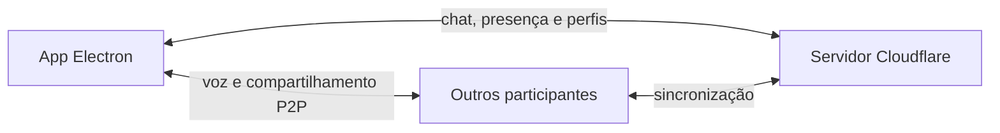

<div align="center">
  

  # Resenhazinha

  **Um espaço simples para conversar, jogar e compartilhar a tela com os amigos.**

  [](https://github.com/Yazzdyz/Resenhazinha-DC-2.0/releases/latest)
  [](https://github.com/Yazzdyz/Resenhazinha-DC-2.0/actions/workflows/validate.yml)
  

  [Baixar a versão mais recente](https://github.com/Yazzdyz/Resenhazinha-DC-2.0/releases/latest) · [Ver novidades](CHANGELOG.md)
</div>

---

O Resenhazinha é um aplicativo desktop inspirado no Discord, pensado para grupos pequenos. Ele reúne chat, chamadas de voz e compartilhamento de tela em um ambiente privado, direto e personalizável.

> Projeto independente, sem vínculo com o Discord.

## Destaques

| Recurso | O que oferece |
| --- | --- |
| **Call para até 6 pessoas** | Voz em tempo real, mute, deafen e volume individual de até 200%. |
| **Compartilhamento de tela** | 720p, 1080p ou 1440p, de 15 a 60 FPS, com áudio do computador. |
| **Chat completo** | Mensagens, respostas, edição, exclusão, menções, emojis, GIFs e anexos. |
| **Perfis personalizados** | Avatar, banner, bio, status, cargos e cores. |
| **Moderação** | Owner, administradores, cargos, mute, remoção da call e expulsão. |
| **Visual ajustável** | Temas claro, escuro e ultra escuro, fundo animado, zoom, desfoque e tamanho da fonte. |
| **Atualização automática** | Novas versões são encontradas e instaladas pelo próprio aplicativo. |

## Download

1. Abra a página da [versão mais recente](https://github.com/Yazzdyz/Resenhazinha-DC-2.0/releases/latest).
2. Baixe o arquivo `Resenhazinha-Setup-*.exe`.
3. Execute o instalador e escolha a pasta de instalação.

### Requisitos

- Windows 10 versão 2004 ou superior, ou Windows 11;
- processador x64;
- conexão com a internet;
- microfone para participar das chamadas.

O aplicativo ainda não possui assinatura digital comercial. Por isso, o Windows pode exibir o SmartScreen na primeira instalação. Confira se o arquivo veio desta página de Releases antes de executá-lo.

## Como funciona



O servidor mantém o grupo, o chat e a presença sincronizados. A mídia da call usa WebRTC diretamente entre os participantes, reduzindo a latência de voz e de tela.

## Desenvolvimento

### Pré-requisitos

- [Node.js 22](https://nodejs.org/)
- npm
- Windows x64 para empacotar e testar a captura de áudio por aplicativo

### Executar localmente

```bash
git clone https://github.com/Yazzdyz/Resenhazinha-DC-2.0.git
cd Resenhazinha-DC-2.0
npm ci
npm run dev
```

### Comandos

| Comando | Função |
| --- | --- |
| `npm run dev` | Abre o Vite e o Electron em modo de desenvolvimento. |
| `npm test` | Executa os testes automatizados. |
| `npm run check` | Roda testes, valida a sintaxe e gera o bundle. |
| `npm run build` | Gera o frontend de produção. |
| `npm run package:win` | Monta o instalador NSIS para Windows x64. |

## Estrutura do projeto

```text
electron/   Processo principal e preload do Electron
public/     Ícones, worklets e recursos estáticos
src/        Interface, estilos, call e integração com o servidor
tests/      Testes das sessões de call e do WebRTC
.github/    Validação e publicação automatizadas
```

## Publicação

As versões seguem [SemVer](https://semver.org/lang/pt-BR/). O fluxo de release é iniciado por uma tag `vX.Y.Z`, valida o projeto, monta o instalador e publica os arquivos necessários para a atualização automática.

O histórico das mudanças está no [CHANGELOG.md](CHANGELOG.md).

## Créditos e terceiros

O aplicativo utiliza projetos de código aberto. As atribuições aplicáveis estão em [THIRD_PARTY_NOTICES.txt](THIRD_PARTY_NOTICES.txt).
